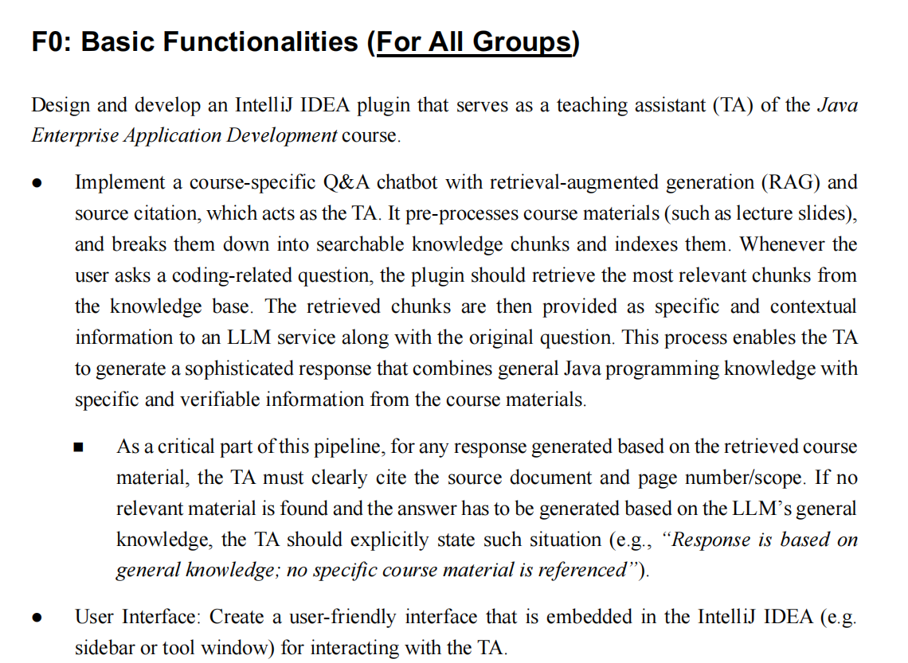
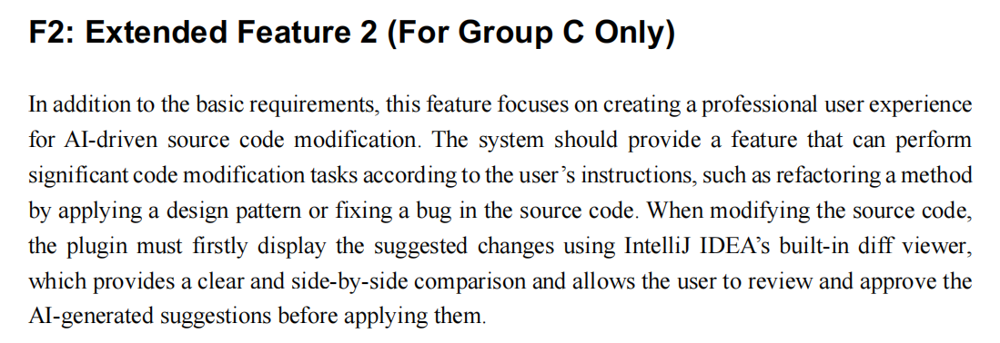
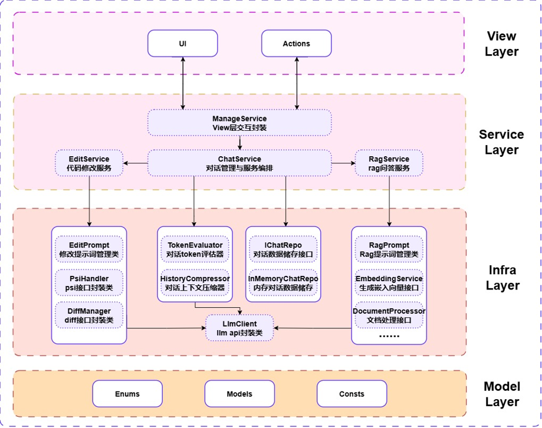
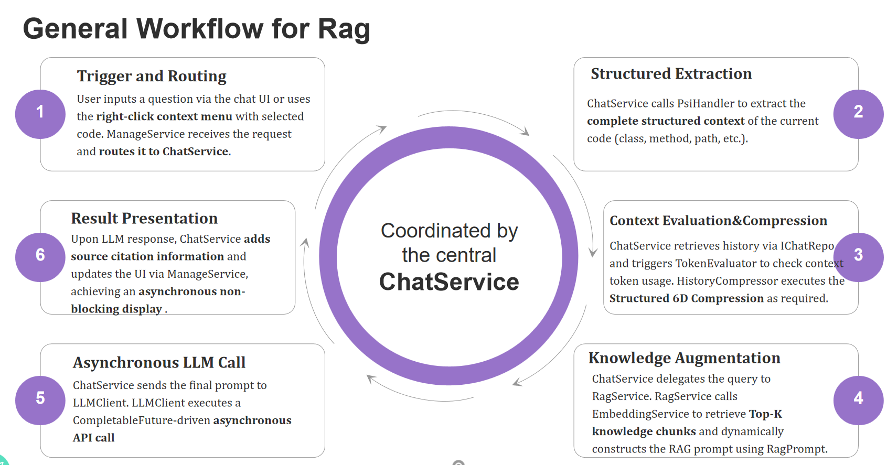
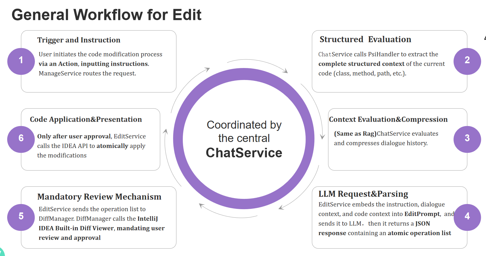

# 2025同济大学计算机学院 Java企业级应用开发课程项目

# MyPilot——一款IDEA AI Coding助手插件

## 项目功能点





## 项目结构

```text
MyPilot                         // 项目根目录
├── doc                         // 文档与演示资料
└── src
    └── main
        ├── java
        │   └── com
        │       └── javaee
        │           └── mypilot                  // 插件代码包根
        │               ├── core                 // 领域层：模型、常量、枚举
        │               │   ├── consts              // 全局常量
        │               │   ├── enums               // 枚举类型
        │               │   └── model               // 领域模型（DTO/VO/POJO）
        │               │       ├── chat                // 聊天相关模型
        │               │       ├── edit                // 编辑/补全相关模型
        │               │       └── rag                 // RAG 检索增强相关模型
        │               ├── infra                // 基础设施层：底层与外部服务
        │               │   ├── api                 // LLM API客户端
        │               │   ├── chat                // token评估与聊天压缩器
        │               │   ├── edit                // IDEA DIFF与PSI封装
        │               │   ├── rag                 // RAG实现
        │               │   │   ├── document            // 文档加载、切分、预处理
        │               │   │   ├── embedding           // 向量化
        │               │   │   └── vector              // 向量库/检索器封装
        │               │   └── repo                // 仓储接口与实现（本地/持久化）
        │               ├── service              // 服务层：用例编排/业务逻辑
        │               └── view                 // 表现层：UI与交互
        │                   ├── action              // 插件 Actions（菜单/快捷键）
        │                   └── ui                  // 面板/对话框/组件
        └── resources
            ├── courseMaterials                  // 课程资料
            │   └── ppt                          // 课件 PPT
            └── META-INF                         // 插件元数据（plugin.xml 等）
```

## 项目架构图



## Rag服务工作流



## Edit服务工作流


